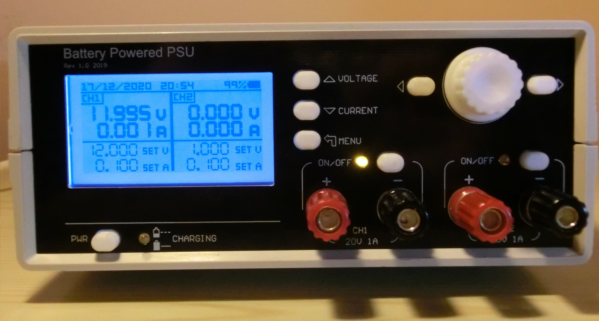
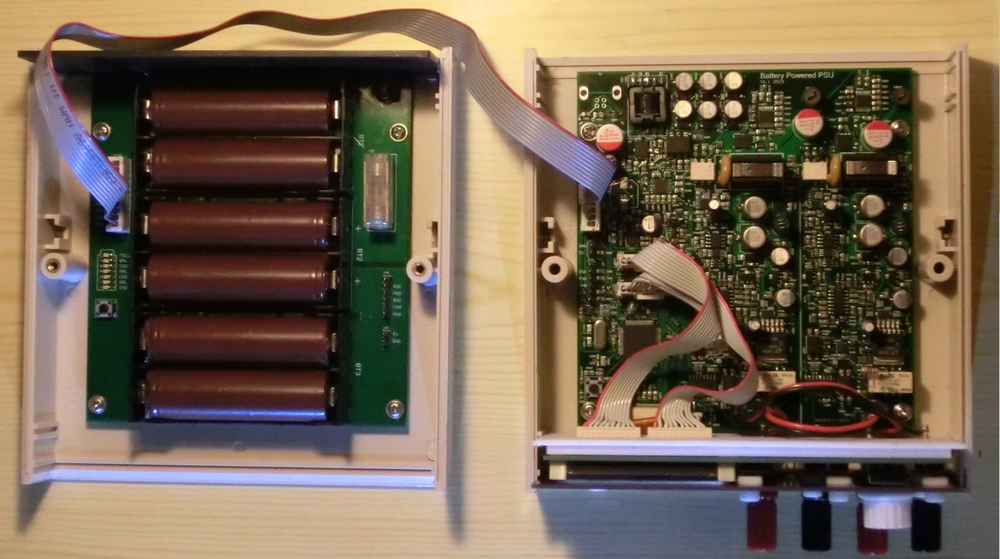
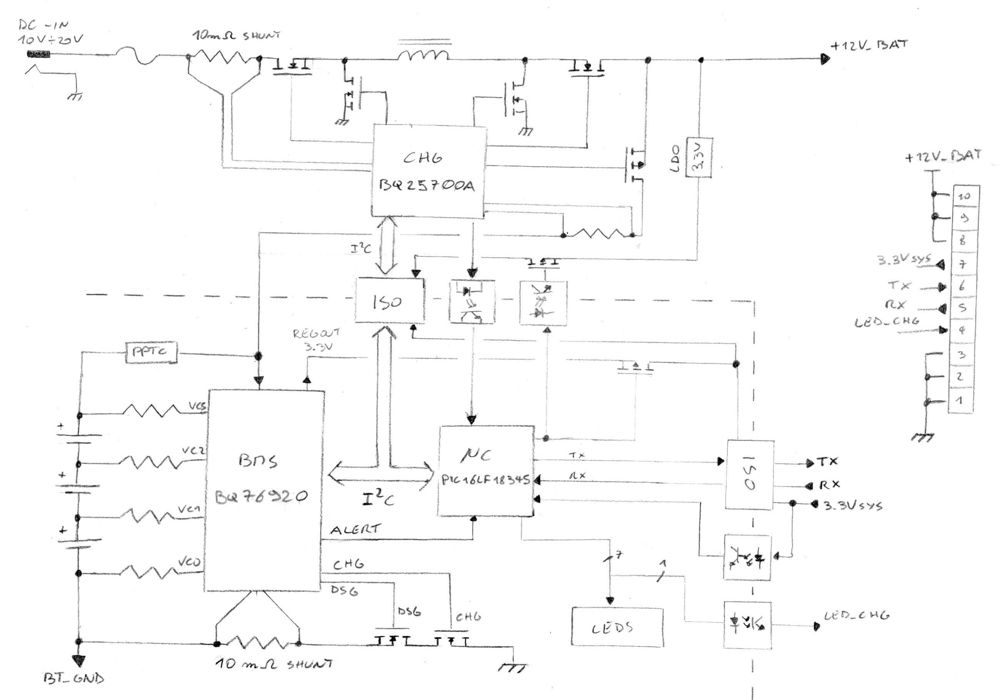
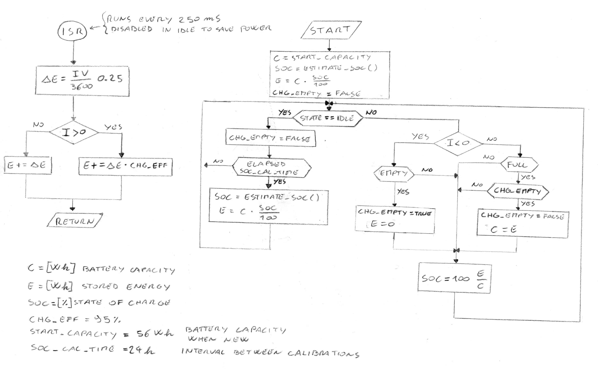
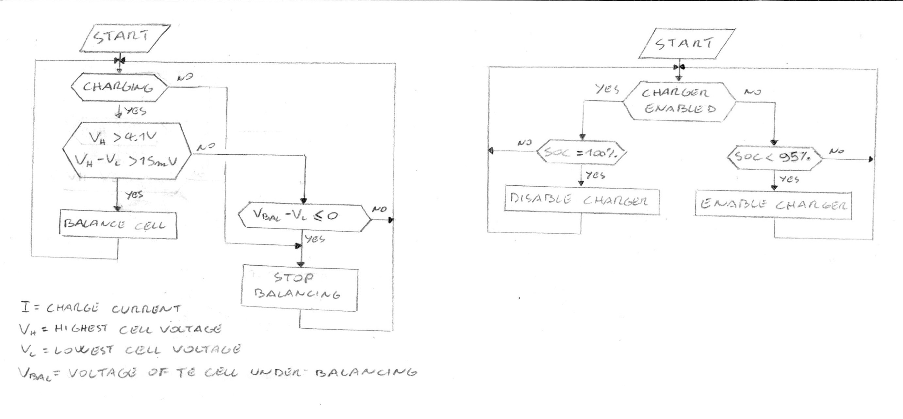
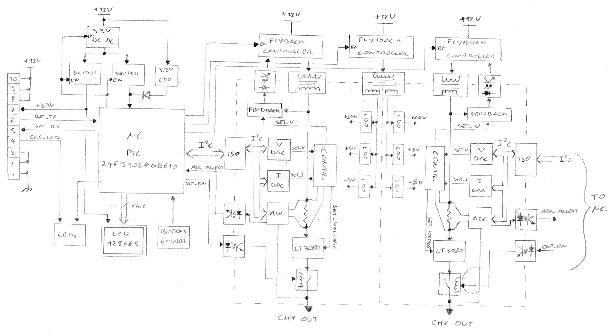
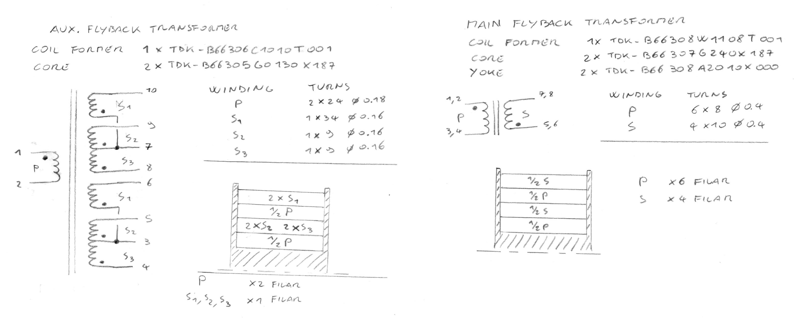

# Battery Powered PSU

<!-- TABLE OF CONTENTS -->

  
Table of Contents

  <ol>
    <li>
      <a href="#about-the-project">About The Project</a>
    </li>
    <li>
      <a href="#getting-started">Getting Started</a>
      <ul>
        <li><a href="#prerequisites">Prerequisites</a></li>
      </ul>
    </li>
    <li>
        <a href="#theory-of-operation">Theory of Operation</a>
        <ul>
            <li><a href="#battery-block-diagram">Battery Block Diagram</a></li>
            <li><a href="#soc-estimation">SOC Estimation</a></li>
            <li><a href="#charging-and-balancing">Charging and Balancing</a></li>
            <li><a href="#psu-block-diagram">PSU Block Diagram</a></li>
            <li><a href="#custom-transformers">Custom Transformers</a></li>
        </ul>
    </li>
    <li><a href="#future-improvements">Future Improvements</a></li>
    <li><a href="#references">References</a></li>
    <li><a href="#disclaimer">Disclaimer</a></li>
  </ol>

<!-- ABOUT THE PROJECT -->
## About The Project
This is a dual-channel power supply powered by 6 18650 Lithium-Ion cells. If like me you don't have lots of space, having a power supply that you can move and get out of the way without getting tangled in cables is quite useful. Inspiration comes from the [uSupply](https://www.eevblog.com/projects/usupply/) designed by Dave Jones on the EEVblog. The only thing this has in common with the original uSupply is the [LT3080](https://www.analog.com/media/en/technical-documentation/data-sheets/3080fc.pdf) low dropout voltage regulator on the output. The remaining hardware has been completely engineered from scratch.\
Schematics and PCBs are designed with Circuit Maker, [link](https://workspace.circuitmaker.com/Projects/Details/ts-manuel/Battery-Powered-PSU-Final) to the project.
### Specifications:
* Powered from 6 x 18650 Lithium-Ion cells (56Wh)
* 2x 20V 1A Isolated outputs
* 1 mV Voltage resolution
* 1 mA Current resolution

<!-- GETTING STARTED -->
## Getting Started
There are two MPLAB X projects, `software\BatteryController.X`  is for the battery microcontroller and `software\PowerSupply.X` is for the main power supply microcontroller. To compile the code just open them into MPLAB X.
### Prerequisites
* [MPLAB X v5.30](https://www.microchip.com/development-tools/pic-and-dspic-downloads-archive)
* [MPLAB Code Configurator v4.x](https://www.microchip.com/mplab/mplab-code-configurator)

<!-- BLOCK DIAGRAM -->
## Theory of Operation
The project is split into two circuit boards. The one on the left is the battery, the other is the power supply. The battery board holds six Lithium-Ion cells, the protection and charger circuitry, and a microcontroller to keep track of the SOC (State Of Charge). All the components besides the cells are located on the backside. The power supply board on the right has all the circuitry to handle the user interface and to generate the output voltages. The output voltage is regulated in two steps, there's a switching pre-regulator to keep efficiency high followed by a linear one to reduce noise.
The two boards are connected by a 10-way cable that carries power and control signals. When the power supply is on, the battery sends its SOC to the PSU via UART.

### Battery Block Diagram
\
This is the simplified block diagram for the battery board. This board is responsible for charging and protecting the Lithium-Ion cells. The three main components are the BMS IC, the charging IC, and the microcontroller.\
The BMS [BQ76920](https://www.ti.com/lit/ds/symlink/bq76940.pdf?ts=1608322350104&ref_url=https%253A%252F%252Fwww.google.com%252F) from Texas Instruments, continuously monitors cell voltages and current. If an over-voltage, under-voltage, or over-current condition is detected the cells are immediately disconnected. The IC also features internal balancing FETs that are activated by the microcontroller to balance the cells. The BMS is connected to the microcontroller through I2C.\
The Charger IC [BQ25700A](https://www.ti.com/lit/ds/symlink/bq25700a.pdf?ts=1608323305999&ref_url=https%253A%252F%252Fwww.google.com%252F) also from Texas Instruments uses a switching buck-boost converter to take the input voltage and charge the cells with a constant-current constant-voltage scheme. Its I2C interface is connected to the microcontroller through an I2C isolator.\
The microcontroller is a [PIC16LF18345](http://ww1.microchip.com/downloads/en/devicedoc/40001795e.pdf) from Microchip. It keeps track of the battery SOC, balances the cels, and enables/disables the charger. The microcontroller is connected directly to the batteries, when the BMS goes into protection mode and the cells are disconnected from the rest of the circuit, the only things powered are the BMS and the microcontroller.\
To save power, voltage to the I2C isolators is removed when they're not in use.

### SOC Estimation
\
The flow chart above describes the SOC Estimation algorithm adopted, it is a variation of this [Coulomb-Counting Algorithm](https://arxiv.org/ftp/arxiv/papers/1803/1803.10654.pdf). Coulomb-Counting consists of temporal integration of the battery current during charge and discharge. To take into account the battery self-discharge, the SOC is recalibrated by looking at the open-circuit voltage after the battery is left sitting unused for 24 hours. During charge and discharge the coulomb-counter 16-bit ADC inside the BMS is active and configured to trigger an interrupt every 250 ms. Inside the microcontroller, there are three variables: capacity, energy, and SOC. When the board is first powered the capacity is initialized with the expected capacity from a new set of cells, the SOC is estimated from the open-circuit voltage, and energy is set as a fraction of the initial capacity based upon the SOC. Each time the BMS triggers an interrupt the energy is updated, when the battery is empty the energy is set to zero.
At the end of the charging process, if the battery has been charged from empty without interruptions, the accumulated energy is by definition the real battery capacity so the capacity variable is updated. This takes into account the aging of the cells in the SOC estimations.

### Charging and Balancing
\
The microcontroller controls the charger IC, when the charging cable is plugged in, the charger is enabled if the SOC is less than 95% and it's disabled when SOC reaches 100%.\
Balancing is performed only near the end of charge when the cell voltages are closer. If the difference in voltage between cells is greater than 15 mV, the balancing FET for the cell with the highest voltage is activated. It remains active until its voltage equals that of another cell. This simple scheme works surprisingly well. Once the cells are balanced they remain aligned pretty much on their own and only small corrections are needed.

### PSU Block Diagram
\
This is the block diagram for the power supply. The microcontroller [PIC24FJ1024GB610](https://www.microchip.com/wwwproducts/en/PIC24FJ1024GB610) handles the user interface and controls the rest of the circuitry. The connection to the LCD uses the EPMP peripheral configured as an 8-bit 6800 bus. The buttons and the encoder are handled by interrupts. When the power supply is turned off, all the flyback converters are disabled, the 3.3V rail is disabled, and the microcontroller enters sleep mode. During sleep the main 8MHz external clock is halted, the only way to wake the CPU is the interrupt triggered by the power button.\
The power supply has two identical isolated channels, to set the output voltage and current limits, each channel has two DACs connected to the same I2C bus through isolators. Control signals are passed on with optocouplers. The output voltage is regulated in two steps, there is a flyback switching converter to keep isolation between channels followed by a linear regulator to reduce noise. The 100KHz clocks for the flyback converters are provided by the microcontroller, the clock signals for the two converters are 180° out of phase, this prevents the primary side MOSFETs from turning on at the same time thus reducing the RMS load on the primary capacitors. There is also a third flyback converter to provide power to the control circuitry.

### Custom Transformers
\
There are three custom transformers: two identical ones for the two main flyback converters and one for the auxiliary flyback converter. The picture above shows the winding scheme for each transformer.

<!-- FUTURE IMPROVEMENTS -->
## Future Improvements
* Fix issues with PCBs
* BOM consolidation
* Add USB functionality to the main uC

<!-- REFERENCES -->
## References
* [Implementation of an Improved Coulomb-Counting Algorithm](https://arxiv.org/ftp/arxiv/papers/1803/1803.10654.pdf)
* [A Closer Look at State of Charge and State of Health Estimation Techniques](https://www.analog.com/media/en/technical-documentation/technical-articles/a-closer-look-at-state-of-charge-and-state-health-estimation-techniques.pdf)
* [Lithium-Ion Battery Cell-Balancing Algorithm for Battery Management System Based on Real-Time Outlier Detection](http://downloads.hindawi.com/journals/mpe/2015/168529.pdf)
* [Flyback transformer design considerations for efficiency and EMI](https://www.ti.com/seclit/ml/slup338/slup338.pdf)
* [Flyback Converter Snubber Design](http://www.ridleyengineering.com/images/phocadownload/12_%20flyback_snubber_design.pdf)
* [Battery university - Charging Lithium-ion](https://batteryuniversity.com/learn/article/charging_lithium_ion_batteries)
* [Battery Cell Balancing - What to Balance and How](https://www.ti.com/download/trng/docs/seminar/Topic%202%20-%20Battery%20Cell%20Balancing%20-%20What%20to%20Balance%20and%20How.pdf)
* [Fast Cell Balancing Using External MOSFET](https://www.ti.com/lit/an/slua420a/slua420a.pdf?ts=1607801941218&ref_url=https%253A%252F%252Fwww.google.com%252F)
* [Cell balancing buys extra run time and battery life](https://e2echina.ti.com/cfs-file/__key/telligent-evolution-components-attachments/13-112-00-00-00-00-58-11/Cell-balancing-buys-extra-run-time-and-battery-life.pdf)

<!-- DISCLAIMER -->
## Disclaimer
The following project is shared "as is", with the sole objective of being useful. The creator of the described piece of hardware and its associated software cannot guarantee its correct functioning under any circumstance. The author of this project will not be held responsible for any material, personal or economic losses to you or any third parties that may arise from using this design. This project will not be used under any circumstances on systems whose responsibility is critical, or from which people's lives depend upon, directly or indirectly.